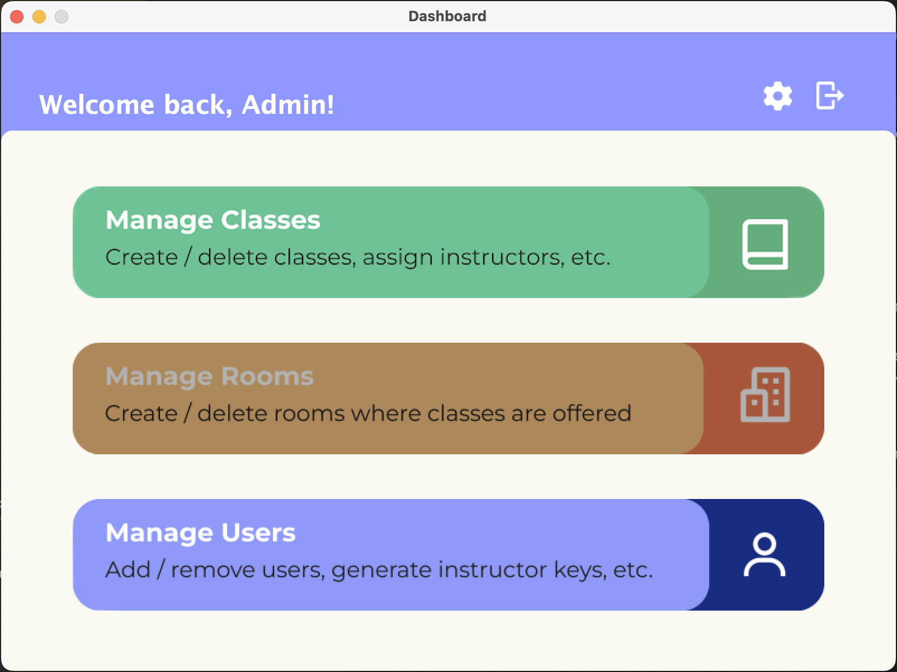
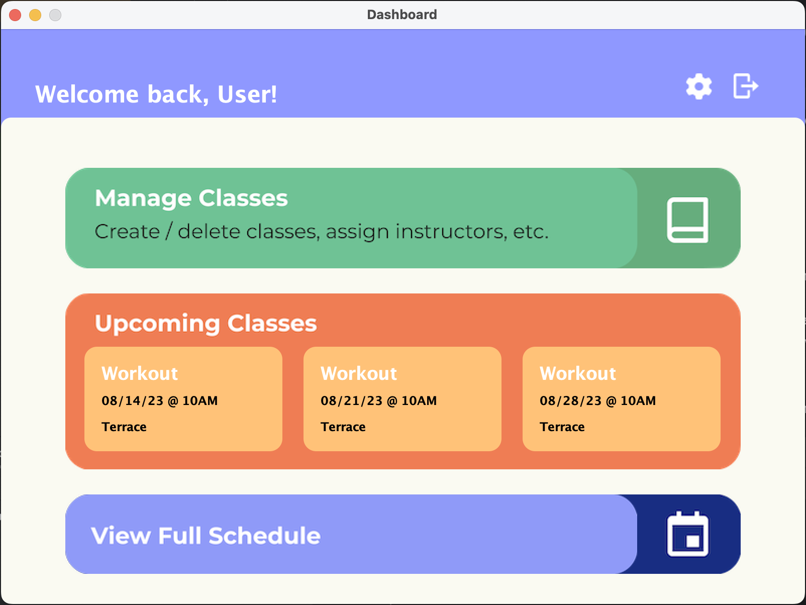
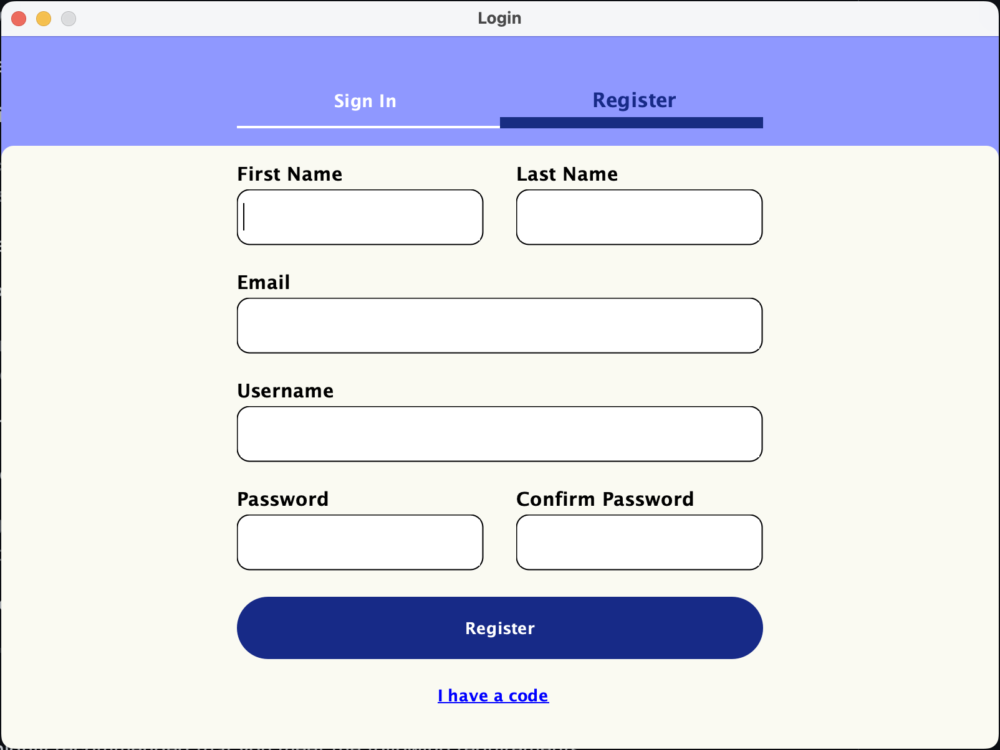
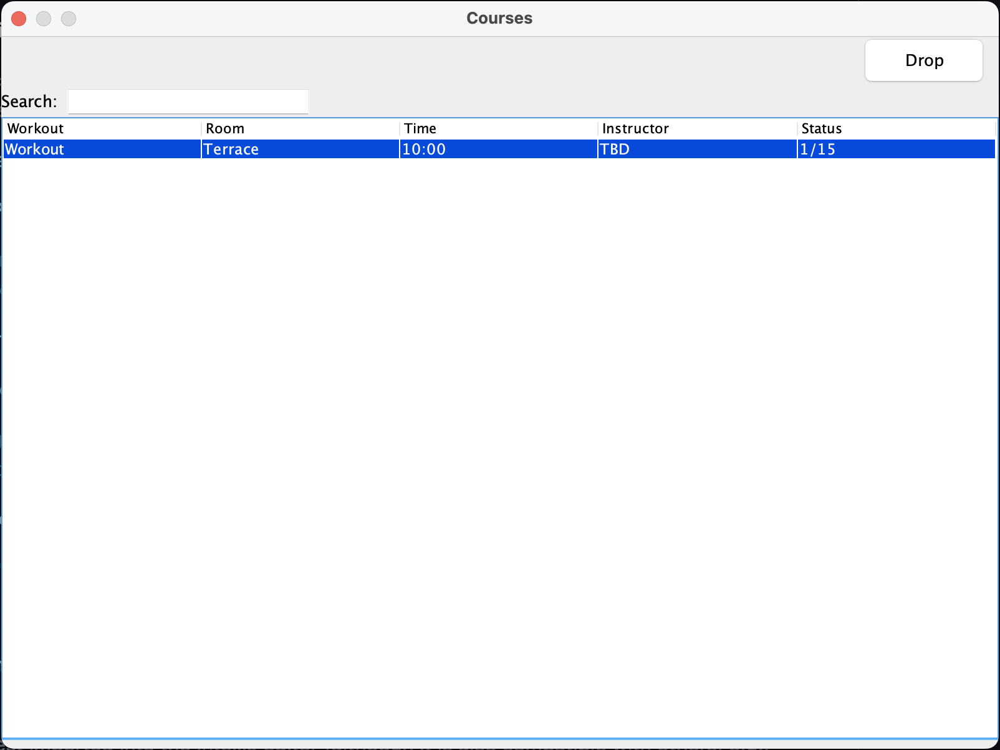

# **SweatSquad Sync.**

### About the Project - What is it?

A comprehensive Java-enabled GUI management software that caters to the need of admins, instructors, and users that are involved with class registration and management at a ‘gym’ or any other relevant institution.

This project intricately streamlines gym operations and the interactive interface's structure extensively serves the distinct needs of administrators, instructors, and users, when it comes to user registration, class scheduling, and more.

- - -

### Features

- **Java-based GUI**
  
  > An interactive graphical user interface that effectively caters towards intuitive navigation and operation.
  

- **Admin Management**:
  
  > Administrators are provided with broad control over user registration and class management.
  

- **User/Instructor Interface**:
  
  > A user centric platform that allows for efficient management of instructor’s classes, seamless registration and enrolment, and relevant display of both user type’s upcoming schedules.

- - -

### Screenshots
##### _Take a sneak peek at some of our project's most notable features and views_:

- **Admin Dashboard**

  > Our main dashboard is the hub of all your system manager's gym management needs. Navigate seamlessly between scheduling, course enrollment, user information, room management, and more.

- Instructor/User -Friendly Dashboard

  > Enrol and drop classes, access account settings, and check out your upcoming schedule from our user-friendly dashboard designed with simplicity and efficiency in mind.

- Easy Registration Process

  > Joining us is a breeze! Our signup panel has clear fields for all your credentials and an easy-to-spot registration button to get you started in no time.

- Manage Your Workouts

  > View and manage the list of attendees for each workout session. Our app provides a clear and organized view to help you keep track of every member attending your classes.

- - -

### Getting started
Before you begin, it is highly recommended that you meet the following requirements:

- Java IDE
  > The project is best imported into the IntelliJ editor (although it is also compatible with others, e.g., Eclipse). Upon import, IntelliJ will automatically recognize this as a Gradle repository.
  > Java JDK/SDK Version: The project's starter code was developed with SDK version 11.0.1. Make sure you're using this version or a later one to ensure compatibility. Note that JDK 16 or newer is also supported.
- Gradle
  > This project utilizes Gradle as its build environment. Ensure that you have Gradle properly set up and functional on your machine.

- - -

### Setting Up the Project

> For those interested in contributing or running the project, please clone the repository and initialize it on your local machine.

1. Clone the repository:
   https://github.com/CSC207-2023Y-UofT/course-project-sweatsquad-sync.git

2. Open the project in your preferred Java IDE
   (IntelliJ IDEA recommended).

3. Configure an updated version of Java with your IDE
   Run the App.java’s Main class to start the application

- - -

### Breakdown of Different Accounts

#### Administrators
- Login
> Admins can use the dedicated login button on the main screen.
- Manage Users
> Navigate to the Users tab to add, delete, or update user details.
- Manage Classes
> Use the Classes tab to manage class information.

#### Instructors
- View Classes
> Instructors can view all the classes assigned to them on their dashboard.
- Add Classes
> New class offerings can be added or removed with timings and other details (capacity, day of the week, etc.).

#### Users
- Register
> Users can sign up using the registration form.
- Enrol
> After logging in, users can view and enrol in their preferred classes.
- Withdraw
> Once enrolled in a class, users can view and drop classes they are already taking.

_Note: Search features for classes has been incorporated for all account types._

- - -

### Directory Breakdown
#### Directories
- fd (frameworks and drivers)
  > This directory contains the various frames and panels that make up the user interface of the application. It also contains the application's main entry point (App.java) and the database classes (GymDatabase.java, FileDatabase.java). This direcotry also contains a 'component factory' which is primarily responsible for stylizing Swing components to be in line with a more modern aesthetic, and can be called as needed in other screens (whehther they be JFrames or JPanels).
- ia (interface adapters)
  > This directory contains the various presenters and view models for the application. Presenters handle the application logic, while view models represent the data that will be displayed in the view.
- abr (application business rules)
  > This directory contains the business rules of the application. It contains classes to manage the users (UserManager.java, ActiveUserManager.java) and the gym (GymManager.java), as well as classes for the authentication process (Authenticator.java, ActivationCodeGenerationStrategy.java, PasswordHashSHA256.java). It also contains data models for input and output (IODataModels).
- ebr (enterprise business rules)
  > This directory contains the entities that represent the different types of users (User.java, Instructor.java, GymAdmin.java) and other entities like Room.java and Workout.java.
  
The dependencies in the architecture are designed to point inward with respect to their directories, from fd → ia → abr → ebr. Each layer is expected to only interact with adjacent layers, layers cannot be skipped. This design strategy ensures a separation of concerns where each layer has a specific job, making the system more modular, maintainable, testable, and extendable for future development.

### Design Patterns
- Model-View Presenter (MVP)
> The application adopts the MVP pattern in its design. The Presenter files handle the application logic, the 'Model', and the Presenter files are responsible for rendering the UI, or the 'View'.
- Data Access Object (DAO)
> The database classes implement the DAO pattern, which provides an abstract interface to the database. This allows the application to switch out the underlying database without changing the application code.
- Factory Pattern
> Different types of User objects (User, RegisteredUser, Instructor, GymAdmin) are created without exposing the instantiation logic to the client.
- Composite Pattern
> The Gym class makes use of the Composite Pattern. It represents part-whole hierarchies, mainly given how it references to User, Instructor, Room, and Class objects.

### SOLID
The SOLID principles have been considered and applied throughout the SweatSquad Sync system design and implementation. Here are some of the ways we have applied each principle:

- Single Responsibility Principle (SRP)
  >Each class in the system has a single responsibility and thus only one reason to change. For instance, the gym classes are solely responsible for managing the gym's attributes, users, and workouts. Similarly, the workout classes are responsible only for managing the details of a workout.

- Open-Closed Principle (OCP)
  > The system is designed to be open for extension but closed for modification. This principle is applied in the gym classes where the addUser, removeUser, addWorkout, removeWorkout, addRoom, and removeRooms methods allow functionality to be extended without modifying the existing code.

- Liskov Substitution Principle (LSP)
  > The system design has been made sure that in any extension would allow for it to be followed. Any future subclasses of Users would be able to substitute for User without affecting the correctness of the program.

- Interface Segregation Principle (ISP)
  > The system uses interfaces to define specific contracts for different types of users.

- Dependency Inversion Principle (DIP)
  > This principle is adhered to in the system's layered architecture, which ensures that higher-leveled modules do not depend on lower-leveled modules. Both depend on abstractions, as all dependencies point inward and each layer only interacts with adjacent layers.
